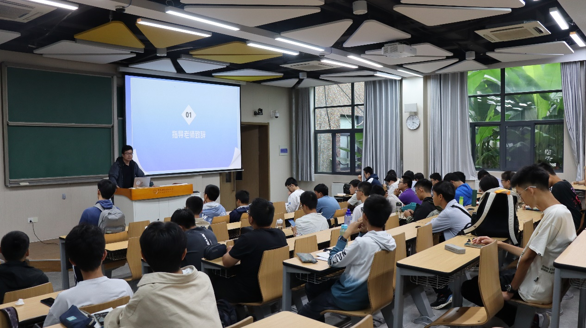
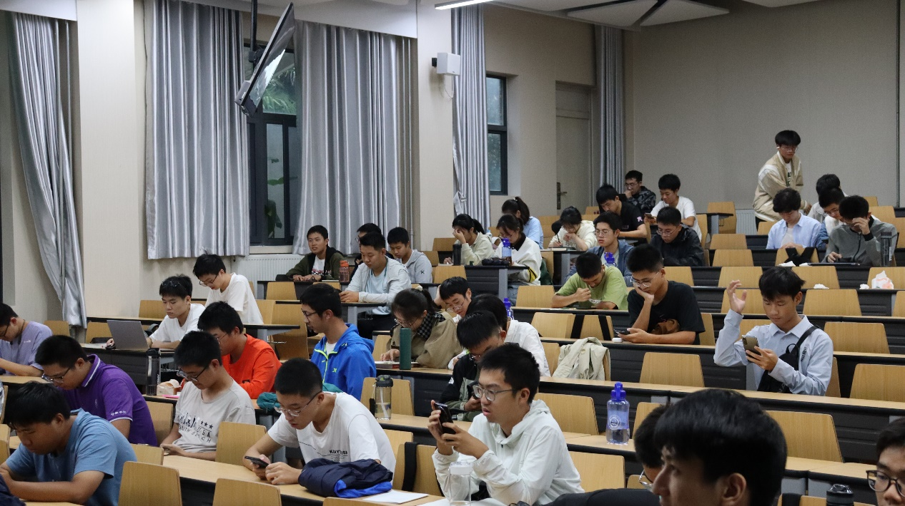
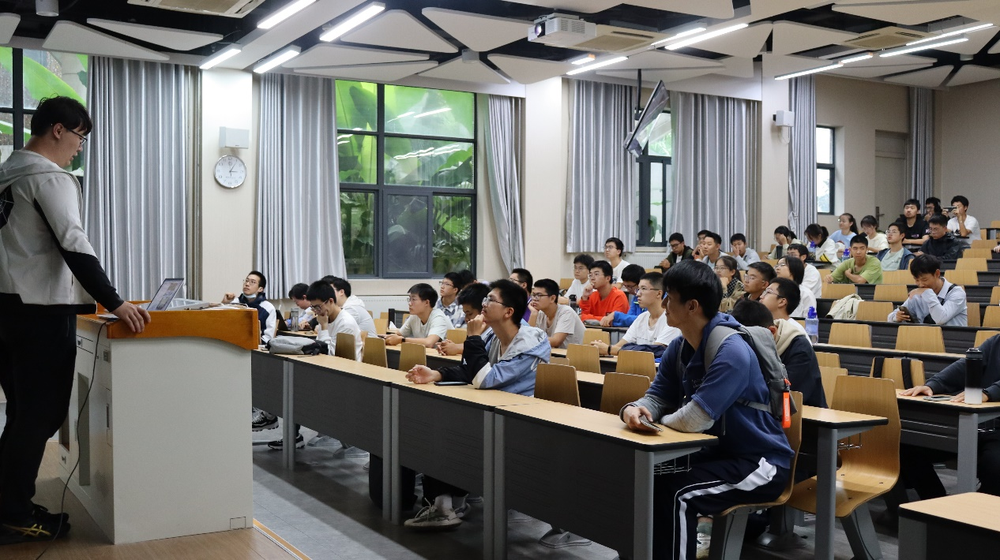

# 校学生机器人俱乐部2023年第一次全员大会

新的一学年，为了欢迎新加入的成员，向大家介绍社团的概况、组织形式以及主要工作，增加大家对机器人俱乐部的了解，我们于9月23日15：00在3C101开展了校学生机器人俱乐部2023年第一次全员大会。
会议由会长薛佳龙同学主持，本次大会主要分为五个部分，依次是指导老师致辞、社团概况、创新课题计划介绍、RoboGame赛事介绍以及机器人俱乐部下属小组招新。
全员大会正式开始，首先社团指导老师董二宝副教授致辞，向同学们大致介绍了机器人俱乐部的历史，结合以往经验告诉了同学们加入机器人俱乐部对个人能力以及发展的好处，并表达了对机器人俱乐部未来发展的殷切期望。他鼓励所有俱乐部成员充分发挥自己的创造力和团队合作精神，在新的学年中追求卓越。他还提到了机器人技术在当今社会的广泛应用，并强调了机器人俱乐部的重要性和使命。

大会进行到下一环节，薛佳龙同学从竞赛、培训、科普三个方面介绍了近三年的社团活动以及对下一学年的活动进行预告，展示了机器人俱乐部活动组织上的多样性，激发了大家对机器人技术的热爱和探索欲望。

接下来，薛佳龙同学向各位同学介绍了机器人创新课题计划，同学可以将创新课题申报为“大学生创新创业”和“大学生研究计划”，同时可获得相应学分，还可以利用该项目申请专利，发表论文等，一举多得。社团主要为同学们提供课题或考察同学们提出课题的可行性，以及技术顾问工作。社团提供这样一个平台，成员们纷纷积极参与讨论，展示了他们对创新的热情和才华。
然后，薛佳龙同学对社团最主要工作之一RoboGame机器人大赛进行了介绍。他详细介绍了RoboGame大赛的历史、规则和主要成果。他们鼓励所有成员积极参与，锻炼技术和团队协作能力，并在比赛中展现出色的表现。

最后，机器人俱乐部还宣布了下属小组招新的消息。不同的小组涵盖了技术组、策划组、宣传组和财务组等领域。成员们可以根据自己的兴趣和专长选择加入相应的小组，并与志同道合的伙伴一起深入学习和研究。
此次全员大会不仅为俱乐部成员提供了一个相互交流和学习的平台，也为新学年的俱乐部活动奠定了坚实的基础。通过指导老师的致和会长薛佳龙同学的介绍，学生们将更加积极地投入到机器人技术的研究和实践中，为推动科技创新做出自己的贡献。
校学生社团管指委、校学生机器人俱乐部
