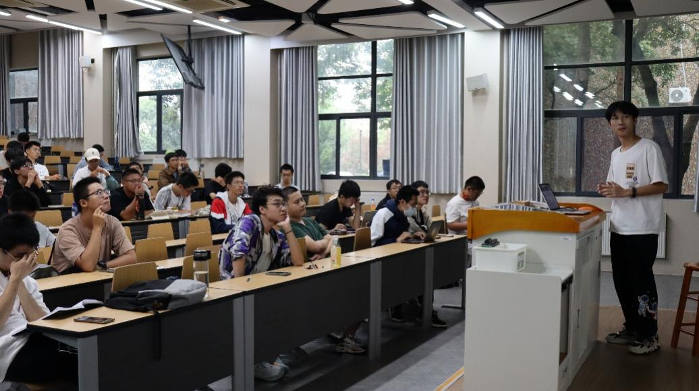

# RoboWalker战队2024赛季第一次全员大会

又是一年迎新季，RoboWalker战队将招收一批新队员，为了增强同学们对战队的了解，方便大家加入战队后选择感兴趣的工作方向，我们于9月24日15：00在3C101开展了RoboWalker战队2024赛季第一次全员大会。
会议由谷俊驰同学主持，他交代了本次大会主要分为两个部分，分别是全国大学生机器人比赛RoboMaster机甲大师赛整体介绍和RoboWalker战队介绍，其中包括各部门同学对本组的介绍。
全员大会正式开始，谷俊驰同学对RoboMaster机甲大师赛事进行了一个整体的介绍。他分别为同学们介绍了1v1步兵对抗赛，3v3对抗赛以及超级对抗赛的赛制。然后他详细的介绍了各个兵种的特点，以及他们在赛场上发挥的作用。通过谷俊驰同学的介绍，现场的各位同学都对赛事有了一个大致的了解。

大会进行到下一环节，首先由谷俊驰同学对战队的组织架构进行了整体介绍。随后，机械组组长，电控组组长，视觉组组长和运营组宣传经理分别上台对本组主要工作进行介绍。

机械组组长林文浩同学从设计、采购和搭建机器人三方面介绍了机械组的主要工作，在讲解过程中，还穿插着机械组工作中一些有趣的现象或常见的失误，激发了在场同学的兴趣。然后，他简单讲解了机械新手入门的方法，期待各位同学的加入。

电控组组长薛佳龙同学从硬件、嵌入式和算法三个方向对电控工作进行了一个较为完善的介绍。他强调，团队工作中，队员的合作于交流是十分重要的，因此他向同学们介绍了电控组成员的主要协作方式。他还介绍了2024赛季电控组的备赛安排，以时间戳的形式向各位同学简明的展示了后续电控组的工作。最后，薛佳龙同学简单描述了加入电控组需要的基础，并告诉大家如何入门，对新成员的加入表示欢迎。

视觉组组长蒋宇航同学在简单介绍机器人视觉的定义后，便结合rm比赛具体分析战队视觉组的主要工作，同时，他也介绍了视觉组所需要的各种基础能力。最后，他告诉同学们我们的队员们参加rm比赛都是凭借着一份热爱，大家在比赛的过程中提升了个人能力，也遇到了志同道合的伙伴，欢迎大家加入我们。

宣传经理汪冰倩同学详细的介绍了运营组的主要工作，并就工作如何开展进行了一些描述。她告诉同学们加入运营组并不需要什么基础，只要愿意付出时间和精力即可。最后，她向同学们展示了一些战队宣传成果，同样期待新成员的到来。

最后，Q&A环节后，RoboWalker战队2024赛季第一次全员大会圆满结束，通过各位战队成员的介绍，参会的同学们已经对比赛和战队都有了较为详细的了解。相信他们心中都已经有了感兴趣方向，我们的战队也将迎来一批新鲜血液，走向崭新的明天。

**校学生社团管指委、机器人俱乐部、RoboWalker战队**