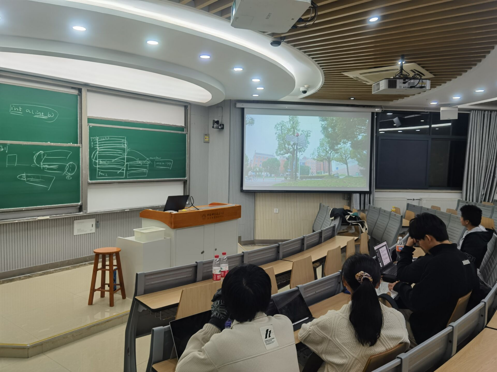
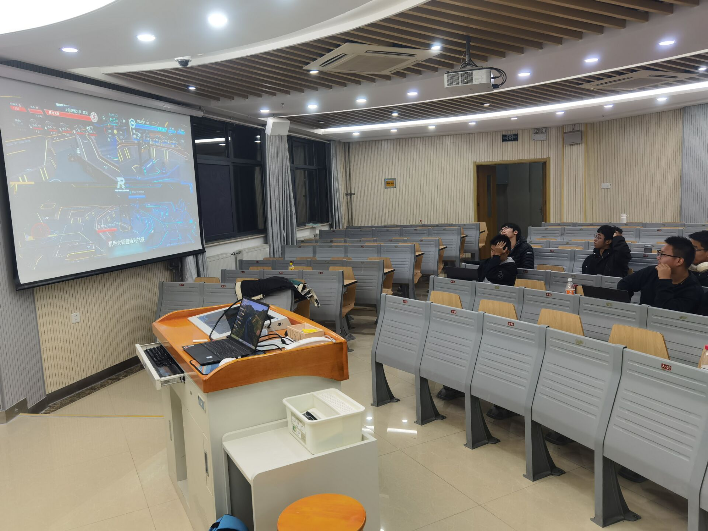

# 中国科学技术大学Robowalker战队启动2024赛季首次视觉培训
中国科学技术大学（USTC）的Robowalker机器人战队于2023年11月11日正式启动2024赛季的首次视觉培训。这次培训的主题是技术交流和共享，以此为新赛季打下坚实的基础。

作为Robomaster比赛中的一员，Robowalker战队一直以其高质量的机器人和出色的团队表现而著名。此次视觉培训的目标是通过规则分析，总结上一赛季的经验教训，同时制定出一套清晰的视觉方案和未来路线。

培训的一部分集中在今年视觉组的整体规划上。作为比赛的关键部分，视觉系统的任务是识别和跟踪比赛中的目标，这对于机器人的定位和行动至关重要。团队在规划中明确了提升视觉系统准确性和稳定性的目标，并计划通过技术创新和持续优化来实现这些目标。

在规则分析环节，战队成员深入研究了Robomaster比赛的规则，以便更好地理解和利用它们。通过对规则的深入理解，团队希望能找到新的策略和方法来提高比赛表现。

此外，团队还共同观看了青年工程师大会上的相关内容，并进行了讨论。这不仅提供了一种了解最新技术趋势和思想的机会，也为团队提供了新的灵感。通过讨论这些内容，团队成员之间的交流和合作得到了加强，这对于团队的整体表现至关重要。

在讨论视觉方案和未来路线的环节中，团队成员分享了自己的观点和想法，对于如何改进和发展视觉系统达成了一致的理解。这是一个值得期待的新赛季，因为团队有望在视觉系统的技术和应用上取得突破。

USTC的Robowalker战队对于即将到来的Robomaster比赛有着高度的热情和期待。通过本次视觉培训，团队的准备工作已经稳步推进。我们期待看到他们在新赛季中带来更多创新和突破，为这项全球的机器人比赛增添更多的色彩和活力。